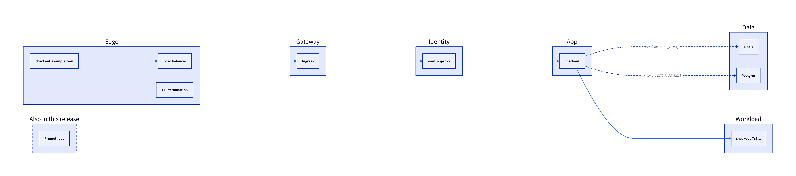
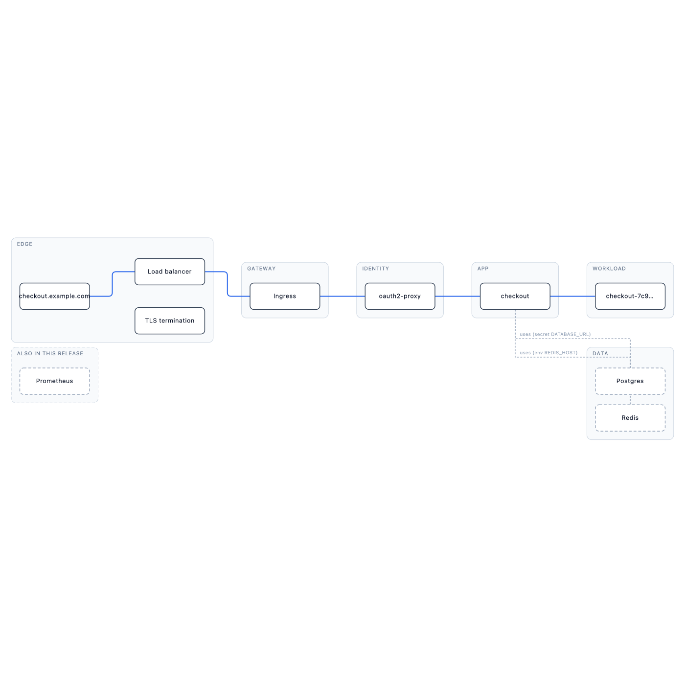

# honest-arch-diagrams

[](https://github.com/albegosu/honest-arch-diagrams/actions/workflows/ci.yml)
[](https://github.com/albegosu/honest-arch-diagrams/releases)
[](https://skills.sh/albegosu/honest-arch-diagrams)
[](LICENSE)

An [Agent Skill](https://agentskills.io) for **honest service-topology / request-path
diagrams**. It separates what is *verified* (the request path) from what is *inferred*
(companions), and it never invents components.

> LLM diagram tools hallucinate. Ask one to "diagram this service" and it draws a Redis, a
> TLS hop, and an auth gateway it never saw. A confident wrong diagram is worse than none.
> This skill makes the agent draw only what it can evidence, and label the rest as inferred.

Works with tools that support the `SKILL.md` standard: Claude Code, Cursor, Gemini CLI,
GitHub Copilot CLI, OpenCode.

**Latest:** [v0.11.0](https://github.com/albegosu/honest-arch-diagrams/releases/tag/v0.11.0) —
evidence strength on models; Compose + diff in v0.10.

## Install

```bash
npx skills add albegosu/honest-arch-diagrams
```

That installs the full package under `skills/honest-arch-diagrams/` (`SKILL.md`, references,
scripts, adapters, schema).

<details>
<summary>Claude Code plugin / manual copy</summary>

**Claude Code**

```text
/plugin marketplace add albegosu/honest-arch-diagrams
/plugin install honest-arch-diagrams@honest-arch-diagrams
```

**Manual**

```bash
git clone https://github.com/albegosu/honest-arch-diagrams
cp -r honest-arch-diagrams/skills/honest-arch-diagrams .cursor/skills/   # Cursor
cp -r honest-arch-diagrams/skills/honest-arch-diagrams .claude/skills/   # Claude Code
cp -r honest-arch-diagrams/skills/honest-arch-diagrams .github/skills/   # GitHub Copilot
```

</details>

## 60-second path

From a clone (Node 18+, zero npm deps):

```bash
npm test
node skills/honest-arch-diagrams/scripts/cli.mjs lint examples/checkout-service.model.json
node skills/honest-arch-diagrams/scripts/cli.mjs layout examples/checkout-service.model.json --svg /tmp/checkout.svg
```

Default deliverable for agents: **model → lint → `layout.mjs` SVG**. D2 is optional
(`to-d2`); Mermaid is last resort only.

Ask the agent things like:

- *"Diagram how a request reaches the checkout service."*
- *"Map this service from these manifests — one app only."*
- *"Turn this OpenTelemetry export into an honest request-path sketch."*

## Example

`examples/checkout-service.model.json` is the source of truth. Blue marks the verified
path; Postgres and Redis are `linked` companions (dashed, evidence on the edge);
Prometheus is `around` ("also in this release," no connector).



Grammar-exact layout (Data under Workload):

```bash
node skills/honest-arch-diagrams/scripts/layout.mjs \
  examples/checkout-service.model.json --svg checkout-service.svg
```



## Share (before / after)

LLM diagrams invent hops. This skill refuses. Side-by-side and GIF live in
[`examples/social/`](examples/social/):

| Asset | For |
|---|---|
| [`before-after-side.png`](examples/social/before-after-side.png) | LinkedIn / static |
| [`before-after.gif`](examples/social/before-after.gif) | X / animation |
| [`og-banner.png`](examples/social/og-banner.png) | GitHub social preview |


Regenerate with the commands in [`examples/social/README.md`](examples/social/README.md)
(`d2` + `ffmpeg`).

## What it does

| Piece | Role |
|---|---|
| Model `{ hops, edges, companions }` | Renderer-agnostic; one app / one spine |
| Honesty linter + JSON Schema | Rejects invented hops, path companions, over-cap |
| `layout.mjs` | Default SVG: lanes, elbows, hop-arc |
| `to-d2.mjs` | Optional themeable D2 |
| `diff.mjs` | Compare two models (added/removed/changed) |
| Evidence adapters | Derive the model from real sources (below) |
| `honest-arch` CLI | One entry for lint / layout / to-d2 / diff / from-* |

## Evidence adapters

Adapters derive the model from a real source so evidence is not "remembered" by the LLM.
Strength varies; adapters do not inflate it.

| Adapter | Evidence strength | Input | Command |
|---|---|---|---|
| **Trace / OTel** | Observed path (strongest) | Span JSON / OTel export | `from-trace` |
| **Kubernetes** | Runtime config | `kubectl … -o json` | `from-k8s` |
| **GitOps / Helm** | Declared cluster config | YAML/JSON manifests (+ optional values) | `from-gitops` |
| **Compose** | Declared services | `docker-compose.yml` | `from-compose` |
| **Terraform** | Infrastructure exists | `terraform show -json` | `from-terraform` |
| **OpenAPI** | Declared contract (weakest) | OpenAPI 3.x JSON/YAML | `from-openapi` |

Paths below are from the repo root. Inside an installed skill, drop the
`skills/honest-arch-diagrams/` prefix. Always pass `--app <name>` on multi-service inputs.

```bash
# Kubernetes
kubectl get ingress,svc,endpoints,deploy -n checkout -o json > dump.json
node skills/honest-arch-diagrams/scripts/cli.mjs from-k8s dump.json --app checkout --out checkout.model.json

# GitOps
node skills/honest-arch-diagrams/scripts/cli.mjs from-gitops ./manifests --app checkout --values values.yaml --out checkout.model.json

# Compose
node skills/honest-arch-diagrams/scripts/cli.mjs from-compose docker-compose.yml --app checkout --out checkout.model.json

# Trace
node skills/honest-arch-diagrams/scripts/cli.mjs from-trace trace.json --app checkout --out checkout.model.json

# Terraform / OpenAPI
node skills/honest-arch-diagrams/scripts/cli.mjs from-terraform tfshow.json --out orders.model.json
node skills/honest-arch-diagrams/scripts/cli.mjs from-openapi orders.openapi.yaml --out orders.model.json

# Then lint + layout
node skills/honest-arch-diagrams/scripts/cli.mjs lint checkout.model.json
node skills/honest-arch-diagrams/scripts/cli.mjs layout checkout.model.json --svg checkout.svg
```

Honesty guarantees shared by adapters: Secret/password **values** are never emitted; URL
credentials are stripped; companions over the cap go to `overflow` (`+N more`).

## Compare two models

```bash
node skills/honest-arch-diagrams/scripts/cli.mjs diff before.model.json after.model.json
node skills/honest-arch-diagrams/scripts/cli.mjs diff before.model.json after.model.json --json --exit-code
```

Reports hops/companions added, removed, or changed. Does not invent topology.

## Validate

```bash
npm test
node skills/honest-arch-diagrams/scripts/lint.mjs examples/checkout-service.model.json
# PASS … (7 hops, 3 companions)
```

The linter fails on missing evidence, companions on the accented path, linked without
anchor, and over-cap counts. Schema:
[`skills/honest-arch-diagrams/schema/model.schema.json`](skills/honest-arch-diagrams/schema/model.schema.json).

## The idea in five rules

1. Verified spine vs best-effort companions (`linked` / `around`).
2. Omitted is absent, not guessed.
3. Never invent a hop from a name.
4. Keep companion evidence visible on the diagram.
5. Accent marks the path — not traffic or health.

Details: [`skills/honest-arch-diagrams/references/honesty-rules.md`](skills/honest-arch-diagrams/references/honesty-rules.md).

## How this differs from other diagram skills

| Skill | Focus | This one instead |
|---|---|---|
| [Archify](https://github.com/Cxdostoyevsky/archify) | Beautiful themeable output | Honesty of the topology |
| [ArchPresent](https://github.com/lewes2/archpresent) | Source-verified L1–L4 inventories | Request-path grammar |
| [c4-codebase-architecture-skill](https://github.com/lmammino/c4-codebase-architecture-skill) | C4 model | Live request path |

## Documentation

| Doc | What |
|---|---|
| [`DEFINITION.md`](DEFINITION.md) | Objective, scope, differentiator |
| [`ROADMAP.md`](ROADMAP.md) | Version history of intent |
| [`CHANGELOG.md`](CHANGELOG.md) | Released changes |
| [`CONTRIBUTING.md`](CONTRIBUTING.md) | How to change the skill safely |
| [`SECURITY.md`](SECURITY.md) | How to report vulnerabilities |
| [`CODE_OF_CONDUCT.md`](CODE_OF_CONDUCT.md) | Community norms |
| [`PUBLISHING.md`](PUBLISHING.md) | skills.sh / agentskill.sh webhook / releases |
| [`skills/honest-arch-diagrams/SKILL.md`](skills/honest-arch-diagrams/SKILL.md) | Skill entry (agents read this) |

## Contributing

PRs welcome if they keep honesty intact and `npm test` green. See
[`CONTRIBUTING.md`](CONTRIBUTING.md).

## License

[MIT](LICENSE) © 2026 Alberto Gonzalez.
